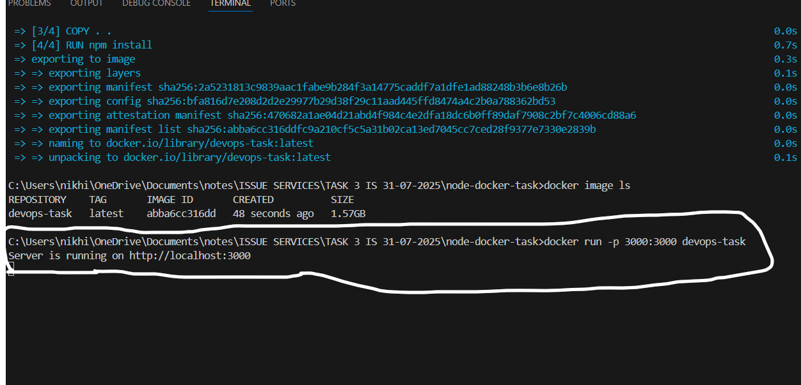
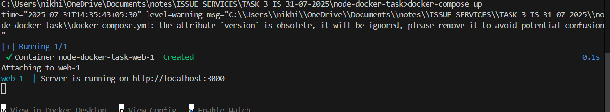
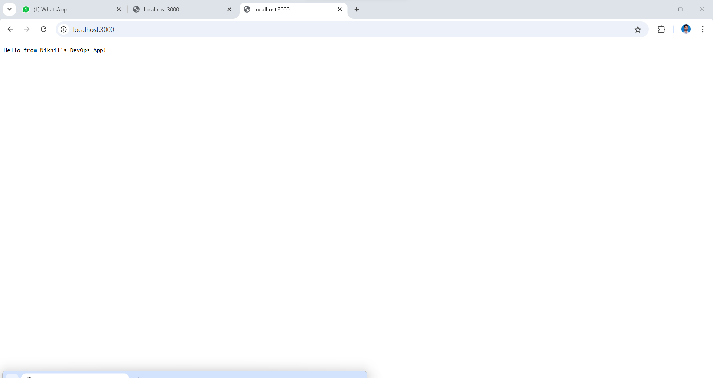

# Node.js Docker Task 🚀

This is a simple Node.js application containerized using Docker. It demonstrates how to build a lightweight container image and run the app using both `docker run` and `docker-compose`.

---

## 📁 Project Structure

```
node-docker-task/
│
├── Dockerfile                # Docker image definition
├── docker-compose.yml        # (Optional) Compose file for easy container setup
├── index.js                  # Main Node.js application
├── package.json              # Project metadata and dependencies
├── README.md                 # 📄 You are here
└── screenshots/              # Screenshots folder
    └── output.png            # Terminal output screenshot
```

---

## ✨ Key Features

- Simple Node.js app that prints a welcome message.
- Runs inside a Docker container.
- `docker run` and `docker-compose` support.
- Easy to build, run, and share.

---

## 🔧 Technologies Used

- Node.js
- Docker
- Docker Compose (optional)
- VS Code (for development)

---

## ⚙️ How to Run

### 1. Using Docker CLI

```bash
# Build Docker image
docker build -t devops-task .

# Run container on port 3000
docker run -p 3000:3000 devops-task
```

---

### 2. Using Docker Compose

```bash
# Start the container using Docker Compose
docker-compose up
```

Then, visit:  
[http://localhost:3000](http://localhost:3000)

---

## 📸 Output Screenshot

Docker Containers Build Output

> Screenshot of the terminal output after running the container:



> Screenshot of the webbrowser output after running the container:


---


## 📸 Output Screenshot

Docker Compose Build Output

> Screenshot of the terminal output after running the container:



> Screenshot of the webbrowser output after running the container:



---

## ✅ Author

**Nikhil B**  
[GitHub](https://github.com/nikhil3939) | [LinkedIn](https://www.linkedin.com/in/nikhil-b-23b89327a)
